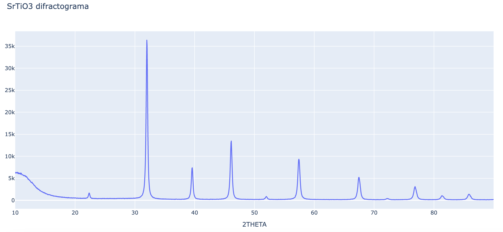

# XRD interpreter

Este código funciona como interprete de archivos de tipo uxd, los cuales son generados por el software [software] utilizado por el equipo difractométro de rayos X [Modelo]

---

## Funcionamiento

El programa está divido en tres archivos diferentes:
1. XRD_file_interpreter.ipynb 
2. grapher.py
3. server.py

---

### XRD_file_interpreter.py

Este archivo contiene notación en Jupyter para tener un mejor entendimiento del programa que se está ejecutando, en el cual estadivido en un apartado que se encarga de abrir, leer y transformar los datos del archivo uxd para su posterior análisis y graficación por plotly.

### grapher.py

Al igual que el archivo __XRD_file_interpreter__. Este abre, lee y transforma los datos del archivo uxd para su posterior análisis. Posteriormente crea la gráifca y la exporta en un archivo de tipo HTML el cual se almacena en la carptea __template__. También despliega una página en la ip local (127.0.0.1) donde podremos observar y manipular la gráfica.

### server.py

Este archivo se encarga de crear un servidor el cual utiliza el archivo HTML generado por el programa __grapher__ y lo aloja para poder ser accesado desde la ruta raíz ('/')

---

## Instalación de paquetes

Para utilizar este programa es necesario instalar los paquetes que vienen especificados en el archivo __requirements.txt__ con el siguiente comando:

`pip install requirements.txt`

o para python3

`pip3 install requirements.txt`

## Información adicional 

El programa sigue en desarrollo, por lo tanto la información obtenida debe ser confirmada bajo un software especializado.
